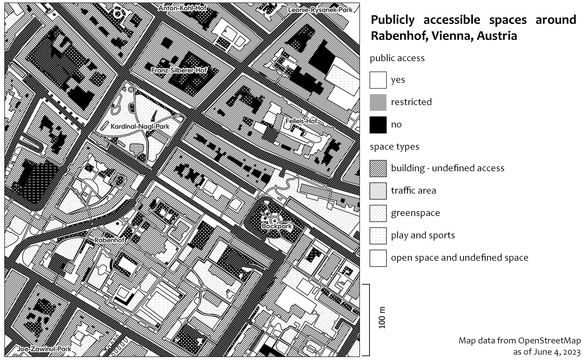

# OSM Public Space Mapper

*This project is a work in progress, but is currently not developed any further.*

## Project description
This repository includes a python script to identify and map publicly accessible space based on OpenStreetMap Data.
I developed it as part of Master thesis in my Master program 'Urban Future' at University of Applied Sciences Potsdam.
The underlying understanding of public space is publicly accessible and usable areas that are outdoor and urban.
Related talks and publications include:
- [Talk at FOSSGIS 2023: Verwendung von OSM-Daten zur Kartierung des urbanen, öffentlichen Raums](https://pretalx.com/fossgis2023/talk/Y77U8A/) and [conference proceedings](https://www.doi.org/10.5281/zenodo.7573277) (March 2023)
- [Talk at FOSS4G 2023: A Modern Nolli Map: Using OpenStreetMap Data to Represent Urban Public Spaces](https://www.youtube.com/watch?v=0hkj281vjI0) (June 2023)
- [Abstract from the ICA: A Contemporary Nolli Map: Using OpenStreetMap Data to Represent Urban Public Spaces ](https://ica-abs.copernicus.org/articles/6/223/2023/index.html)
- [Full Master thesis: Kartierung von öffentlichen Räumen auf Basis von OpenStreetMap Daten](https://doi.org/10.48711/20231028-000) (Juli 2023)

## Usage

The script works with an extract of OSM data, for example downloaded from Geofabrik and cropped with a command line tool like Osmosis.
Results on the edges are improved if complete ways are added, e.g. with Osmosis:

```bash
osmosis --read-pbf file=case_studies/orig-data/austria-latest.osm.pbf --bounding-box left=16.39885944803246 right=16.405590927719924 top=48.198866317671815 bottom=48.19436970139387 completeWays=yes --write-pbf case_studies/data/Rabenhof.osm.pbf
```
Apart from the dataset in osm.pbf format, the coordinates of the bounding box and the target filename have to be passed to the script.
The local CRS is set to EPSG 3035 for European Lambert Azimuthal Equal Area but can be changed to a more precise, local CRS.
The projection is required for buffer processing.
Other local variables can be set in example_application/local_variables.py.
The data analysis is brought together in osm_public_space_mapper.data_analysis
full_data_analysis and uses multiple other modules from the package and the custom classes BoundingBox, GeometryElement and OsmElement defined in osm_public_space_mapper.utils.
The result will be a GeoJSON file with Polygon objects (EPSG 4326) and the attributes space_type, access and a combination of these two in viz-category.
If elements are left with undefined access, the space_type should be checked and access should be derived from that.
An OSM extract for a part of Vienna's third district around Rabenhof, downloaded on June 5, 2023, is provided as sample data under OSM Licence: [OpenStreetMap](https://wiki.osmfoundation.org/wiki/Licence/Attribution_Guidelines).
The example_application can for example be visualized according to public accessibility and space type as shown in this example, visualized in QGIS:


## Code structure

The code for data processing consists of the osm_public_space_mapper package and data for an example application in the example_application folder.
The different data analysis steps are combined in the full_data_analysis.py module of the data_analysis subpackage.
There, functions from a total of seven modules are imported and called for the various processing steps.
In the utils subpackage, the necessary classes (BoundingBox, GeometryElement and derived from them OsmElement) and auxiliary functions (in helpers.py) are defined.

## Limitations

### Technical limitations

The script is not optimized for performance.
An analysis for an area of around 1 km2 should be processed in around five minutes.
Bigger areas take significantly longer.

### Filtering limitations

The analysis only looks at outdoor elements.
Buildings and everything located in buildings is ignored.
Apart from that, OSM relations are not processed (used package esy.osm.shape can not transform OSM relations to shapely geometries).
The analysis is built from a groundfloor perspective, ignoring elements that are not on the ground floor and cropping buildings, if a building passage leads through them.

### Context limitations

The analysis was developed with Western European cities in mind and is applied to a part of Vienna.
The assumptions about public space lying behind the analysis might not be equally applicable to very different cultural and spatial contexts.

## Contributing

Contributions are welcome! If you can see a way to improve this project:

- Do click the fork button
- Make your changes and make a pull request.

Or to report a bug or request something new, make an issue.

## Note of thanks

Many thanks for the support to my supervisors Dr. Florian Ledermann, Andrea Binn and Prof. Dr. Marian Dörk

## Contact

Ester Scheck, [ester.scheck@geo.tuwien.ac.at](mailto:ester.scheck@geo.tuwien.ac.at)
